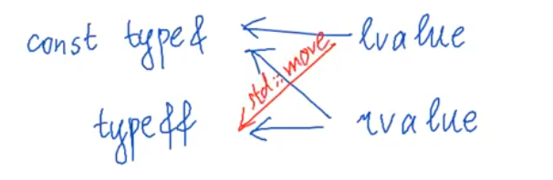

## Фрмальное определение lvalue и rvalue

Категории lvalue и rvalue неприменимы ни к объектам, ни к типам, но существуют lvalue/rvalue-ссылки, сбивающие с толку похожестью называний. lvalue/rvalue-ссылки &ndash; это уже полноценные типы данных. Осталось разобраться в том, как всё это связано друг с другом.

 

В первом приближении определение категории выражения можно провести, пользуясь следующей таблицей

|| lvalue |  | rvalue |
|---|---|---|---|
|1| идентификаторы x |   | литералы 5, 3.0f  |
|2| выражения присваивания =, +=, ... (над примитивными типами)      |   | бинарные операторы +, -, /, ... (н.п.т.)
|3| префиксный инкремент/декремент ++x (н.п.т.) || постфиксный инкремент/декремент x++ (н.п.т.) |
|4| унарная * (н.п.т.)|| унарный &, +, - (н.п.т.)|
|5| результат оператора ?, если оба операнда lvalue || результат оператора ?, если хотя бы один операнд rvalue |
|6|результат оператора "," (запятая), если правый операнд lvalue|| результат оператора "," (запятая), если правый операнд rvalue |
|7|результат вызова функции/метода, если возвращаемый тип lvalue-ссылка||результат вызова функции/метода, если возвращаемый &ndash; тип не ссылка|
|8|результат приведения типов, если возвращаемый тип lvalue-ссылка ||результат приведения типов, если возвращаемый тип &ndash; не ссылка |

Она отражает положение дел до появления стандарта C++11. Особую ценность представляют пункты 7 и 8, причем в случае выражений rvalue остается некоторая недосказанность. 

 

|| lvalue |  | rvalue |
|---|---|---|---|
|1| идентификаторы x |   | литералы 5, 3.0f  |
|2| выражения присваивания =, +=, ... (над примитивными типами)      |   | бинарные операторы +, -, /, ... (н.п.т.)
|3| префиксный инкремент/декремент ++x (н.п.т.) || постфиксный инкремент/декремент x++ (н.п.т.) |
|4| унарная * (н.п.т.)|| унарный &, +, - (н.п.т.)|
|5| результат оператора ?, если оба операнда lvalue || результат оператора ?, если хотя бы один операнд rvalue |
|6|результат оператора "," (запятая), если правый операнд lvalue|| результат оператора "," (запятая), если правый операнд rvalue |
|7|результат вызова функции/метода, если возвращаемый тип lvalue-ссылка| результат вызова функции/метода, если возвращаемый тип rvalue-ссылка |результат вызова функции/метода, если возвращаемый &ndash; тип не ссылка|
|8|результат приведения типов, если возвращаемый тип lvalue-ссылка | результат приведения типов, если возвращаемый тип rvalue-ссылка|результат приведения типов, если возвращаемый тип &ndash; не ссылка |


rvalue-ссылка &ndash; это ссылка, которая ведет себя как обычная ссылка, но порождается выражением категории rvalue. 

За подробностям об актуальном наборе категорий выражений и правилах вывода стоит обращаться к нужному стандарту https://en.cppreference.com/w/cpp/language/value_category

## Инициализация rvalue-ссылок

разминка и lvalue-ссылки

```cpp
int main() {
    int x = 0;
    int& rx1 = x; // теперь rx -- другое имя (ссылка) для x
    int& rx2 = 1; // не сработает: нельзя инициализировать 
                 // неконстантную ссылку с помощью выражения rvalue
    const int& rx3 = 1; // а для константной ссылки всё в порядке
}
```
rvalue-ссылки

```cpp
int main() {
    int x = 0;
    
    int&& rrx1 = x; // не сработает, нужно выражение rvalue
    int&& rrx2 = 1; // сработает, при этом произойдет продление жизни значени 1 
                    // до границы области видимости rrx2
}
```

Вопрос: что произойдет в следующем случае?
```cpp
int main() {
    int x = 0;
    int&& rrx = 1; 
    rrx = x;
}
```
Код скомпилируется, потому что после инициализции rrx является ссылкой. А для ссылок такое присваивание значений допустимо.

Вопрос: что произойдет в следующем случае?
```cpp
int main() {
    int&& rrx = 1; 
    int& rx = rrx; // всё хорошо, rrx -- это идентификатор, а поэтому lvalue 
}
```

Константность ведет себя как и прежде

```cpp
int main() {
    int&& rrx = 1; 
    const int& rx = rrx; // здесь всё хорошо
}
```

Общее заключение: правила игры для rvalue-ссылок отличаются лишь на этапе инициализации и при возвращении из функций. 

Но как быть, если хочется сделать новую rvalue-ссылку на уже существующий объект?

```cpp
int main() {
    int&& rrx1 = 1; 
    int&& rrx2 = rrx1;  // не получится
}
```

<details><summary>code snippet</summary>
<p>
Нужно воспользоваться std::move, она позволяет инициализировать rvalue-ссылку посредством существующего объекта

```cpp
int main() {
    int&& rrx1 = 1; 
    int&& rrx2 = std::move(rrx1);  
}
```
</p>
</details>

## Аналогии std::move 

std::move изменяет категорию выражения на rvalue (позволяя тем самым использовать перемещающие методы вместо копирующих)



При желании, можно увидеть здесь аналогию с кастами


## Универсальные ссылки и сворачивание ссылок

Допустим, мы хотим реализовать функцию std::move. Она должна принимать как rvalue-, так и lvalue-выражения, а затем изменять их категорию. Каким образом это можно сделать?

Имеющиеся инструменты не подходят
```cpp
f(type& x) {}       // только lvalue
f(type&& x) {}      // только rvalue
f(const type& x) {} // lvalue/rvalue, но без возможности модификации
```

Разработчики C++ предложили следующее решение: опеределить шаблонную функцию специального вида

```cpp
template <typename T>
void f(T&& x) {} // такая функция умеет принимать как lvalue, так и rvalue
```
В данном случае T&& называется универсальной ссылкой. Это неофициальный термин, но прижившийся в среде разработчиков. При этом также изменяется схема шаблонного вывода. Обычно при выводе типа амперсанды отбрасываются

```cpp
int main() {
    f(5); // 5 - rvalue, T = int, decltype(x) = int&&
}
```

Но когда передается lvalue в функцию, параметризованную T и принимающую в качестве аргумента T&&, выведенный тип сохраняет один амепрсанд

```cpp
int main() {
    int y = 5;
    f(y); // y - lvalue, T = int&, 
          // decltype(x) = ? (зависит от категории переданного выражения) 
}
```

Правила сворачивания ссылок

& + & = & 

& + && = &

&& + & = &

&& + && = &&

Вопрос: является T&& универсальной ссылкой в следующем примере?

```cpp
template <typename T>
class Vector {

    //...

    void push_back(T&& value) {
        if (sz == cap) reserve(2 * cap);
        AllocTraits::construct(alloc, arr + sz, value);
        ++sz;
    }
}
```

Ответ: нет, потому что T является шаблонным параметром класса, а не функции. Типы будут выведены в момент создания экземпляра данного класса.

## Реализация std::move

Имея в руках механизм универсальных ссылок, можно взяться за собственную реализацию std::move

```cpp
template <typename T>
std::remove_reference_t<T>&& move(T&& x) noexcept {
    return static_cast<std::remove_reference_t<T>&&>(x);
}
```

## std::forward

перемещает то, что следует перемесить, и копирует всё остальное

```cpp
template <typename T>
T&& move(std::remove_reference_t<T>& x) noexcept {
    return static_cast<T&&>(x);
}
```

1:25