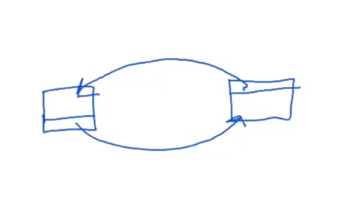

# weak_ptr
Пусть существует механизм управление памятью. Самый простой вариант реализации: подсчитывать ссылки на используемые объекты, не работает из-за циклических зависимостей.

 

 Указатели shared_ptr реализуют именно протейший механизм, поэтому не могут самостоятельно справиться с циклическими зависимостями. 

 Для решения описанной проблемы был создан механизм weak_ptr. Объекты типа weak_ptr не являются полноценными указателями, но с их помощью можно 
 
 1) проверить доступность связанного объекта 
 2) создать shared_prt на связанный объект (если он доступен)
 
  Непосредственно weak_ptr нельзя разыменовывать, а также их количество не учитывается при подсчете ссылок другими типами указателей.

<span style="background-color: green">Пример: как weak_ptr позволяет устранить циклы в структуре данных</span>

## Реализация weak_ptr

```cpp
template <typename T>
class weak_ptr {
private:
    ControlBlock<T>* cptr = nullptr;

public:
    weak_ptr(const share_ptr<T>& p): cptr(p.cptr) {}

    bool expired() const {

    }

    shared_ptr<T> lock() const {

    }
};
```

<span style="background-color: green">upd code for shared_ptr</span>

## enable_shared_from_this

Мы работаем с объектом, скрытым за умным указателем типа shared_ptr. Как получить из метода объекта ещё один shared_ptr-указатель на себя?

В решение проблемы поможет паттерн CRTP (= Curiously Recursive Template Pattern). А именно, нужно добавить к классу специальный шаблонный интерфейс. Получившаяся конструкция выглядит неожиданно, но не противоречит правилам языка.

```cpp
struct S: public enable_shared_from_this<S> { // выглядит интригующе, но здесь просто
                                              // сразу подставяется тип-параметр
    shared_ptr<S> getPointer() const {
        // ...
        return shared_from_this();
    }
};
```

Класс enable_shared_from_this<T> позволяет хранить и использовать информацию об умных указателях на данный объект.

```cpp
template <typename T>
class enable_shared_from_this {
private: 
    weak_ptr<T> wptr = nullptr;

public: 
    shared_ptr<T> shared_from_this() const {
        return wptr.lock();
    }
}
```

Однако эту информацию об указателях нужно как-то передать в объект. Это делается при инциализации shared_ptr.

```cpp
template <typename T>
class shared_ptr {
    // ...
public:
    explicit shared_ptr(T* ptr): cptr(new ControlBlock<T>{1, ptr}), ptr(ptr) {
        if constexpr (std::is_base_of_v<enable_shared_from_this<T>, T>) {
            ptr->wptr = *this;
        }
    }
};
```

